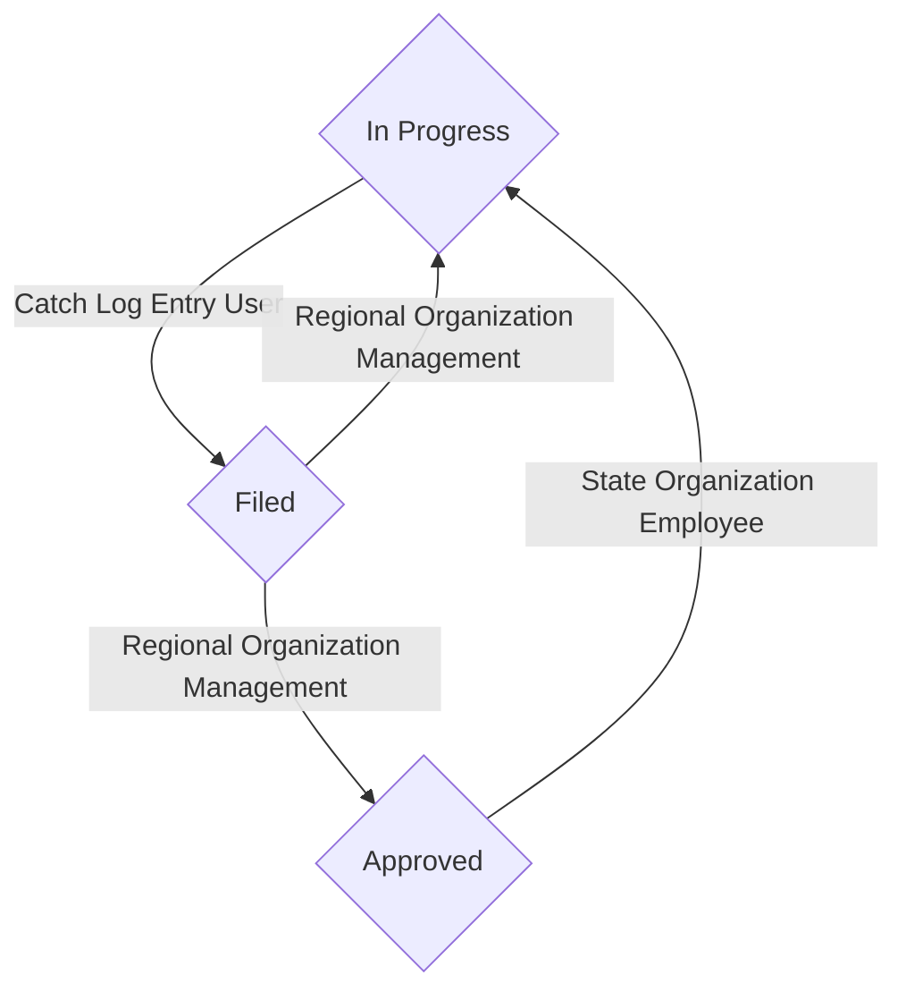

For **Catch Log Entry**, we have a workflow that looks like this:

```mermaid
flowchart TD
    A{In Progress} -->|Catch Log Entry User| B{Filed}
    B -->|Regional Organization Management| C{Approved}
    B -->|Regional Organization Management| A
    C -->|State Organization Employee| A
```

> Roles permitted to change the status as labels on the arrows.
