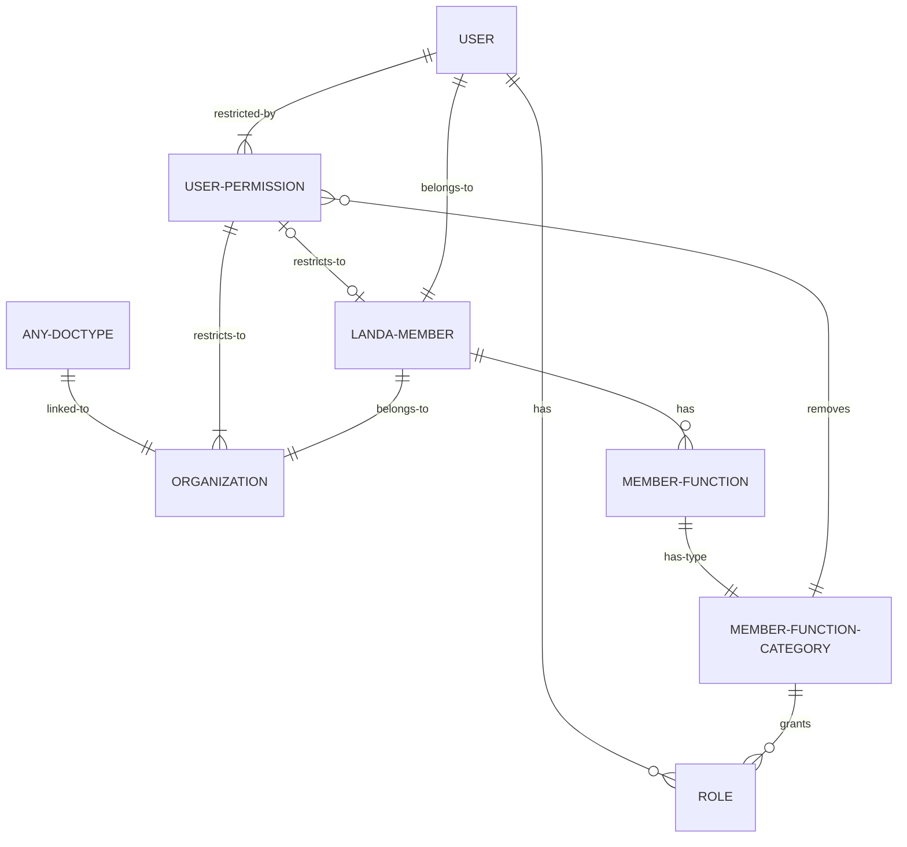

Prerequisites:

- [Organizations and Members](organizations-and-members.md)

A **LANDA Member** always belongs to a Local Organization or to a Local Group. By default, new **Users** are restricted to see only data of their own **Organization** and **LANDA Member**. For example, a member AVL-001-001 has the following **User Permissions** by default:

- _Allow **Organization** for value "AVL-001"_, and
- _Allow **LANDA Member** for value "AVL-001-001"_.

A **Member Function Category** is similar to a **Role Profile** in that it defines the roles a user should get. But it may also define relaxed **User Permissions** (access to lower level organizations, access to member data). In a **Member Function Category** we can define

- the required roles,
- at which level in the **Organization** tree a member can act, and
- whether they can view/edit the personal data of other members.

A **Member Function** assigns a **Member Function Category** to a **LANDA Member**, for a specific period of time. When a **Member Function** is enabled, the member/user gets the additional permissions defined in the **Member Function Category**. When a **Member Function** is disabled, the member/user loses the additional permissions defined in the **Member Function Category**.

When there are multiple active **Member Function Categories** for a member/user, they get the highest permissions possible. This means the union of all roles, access at the maximum allowed level, and access to member data, if any.

If a member/user is allowed to view/edit the personal data of other members, the default **User Permission** _Allow **LANDA Member** for value "AVL-001-001"_ will be removed.

If a member/user is allowed access to lower level organizations, the default **User Permission** _Allow **Organization** for value "AVL-001"_ will be adjusted. For example, to _Allow **Organization** for value "AVL"_.

### Tag permissions

We want to restrict tags to Organizations. A user is supposed to see only tags created by people in the same **Organization**.

The default way to achieve this would be adding a link field from **Tag** to **Organization**. Then the user permissions would take care of the rest. However, for tags, the ID is also the visible label. This means that two organizations would not be able to use the same tag.

To prevent this, we added a table named **Tag Organization** to the **Tag** doctype. When a new tag is created, the creator's organization is added to this table. We also added a custom permission query which checks if the user's organization is in this table. This way users can only see tags created by people in the same organization.

See https://github.com/alyf-de/landa/pull/254 for details.
